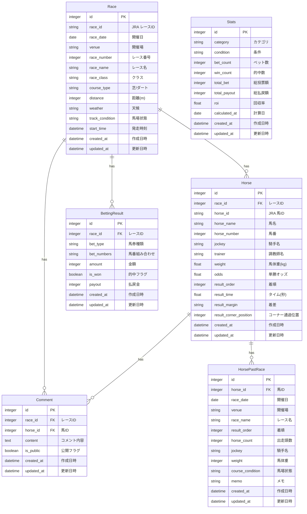

# データベース設計

## ER図 (Mermaid形式)

```mermaid
erDiagram
    Race ||--o{ Horse : "has"
    Race ||--o{ Comment : "has"
    Horse ||--o{ Comment : "has"
    Race {
        integer id PK
        string race_id "JRA レースID"
        date race_date "開催日"
        string venue "開催場"
        integer race_number "レース番号"
        string race_name "レース名"
        string race_class "クラス"
        string course_type "芝/ダート"
        integer distance "距離(m)"
        string weather "天候"
        string track_condition "馬場状態"
        datetime start_time "発走時刻"
        datetime created_at "作成日時"
        datetime updated_at "更新日時"
    }
    Horse {
        integer id PK
        integer race_id FK "レースID"
        string horse_id "JRA 馬ID"
        string horse_name "馬名"
        integer horse_number "馬番"
        string jockey "騎手名"
        string trainer "調教師名"
        float weight "馬体重(kg)"
        float odds "単勝オッズ"
        integer result_order "着順"
        float result_time "タイム(秒)"
        string result_margin "着差"
        integer result_corner_position "コーナー通過位置"
        datetime created_at "作成日時"
        datetime updated_at "更新日時"
    }
    HorsePastRace {
        integer id PK
        integer horse_id FK "馬ID"
        date race_date "開催日"
        string venue "開催場"
        string race_name "レース名"
        integer result_order "着順"
        integer horse_count "出走頭数"
        string jockey "騎手名"
        integer weight "馬体重"
        string course_condition "馬場状態"
        string memo "メモ"
        datetime created_at "作成日時"
        datetime updated_at "更新日時"
    }
    Comment {
        integer id PK
        integer race_id FK "レースID"
        integer horse_id FK "馬ID"
        text content "コメント内容"
        boolean is_public "公開フラグ"
        datetime created_at "作成日時"
        datetime updated_at "更新日時"
    }
    BettingResult {
        integer id PK
        integer race_id FK "レースID"
        string bet_type "馬券種類"
        string bet_numbers "馬番組み合わせ"
        integer amount "金額"
        boolean is_won "的中フラグ"
        integer payout "払戻金"
        datetime created_at "作成日時"
        datetime updated_at "更新日時"
    }
    Stats {
        integer id PK
        string category "カテゴリ"
        string condition "条件"
        integer bet_count "ベット数"
        integer win_count "的中数"
        integer total_bet "総投票額"
        integer total_payout "総払戻額"
        float roi "回収率"
        date calculated_at "計算日"
        datetime created_at "作成日時"
        datetime updated_at "更新日時"
    }

    Horse ||--o{ HorsePastRace : "has"
    Race ||--o{ BettingResult : "has"
``` 